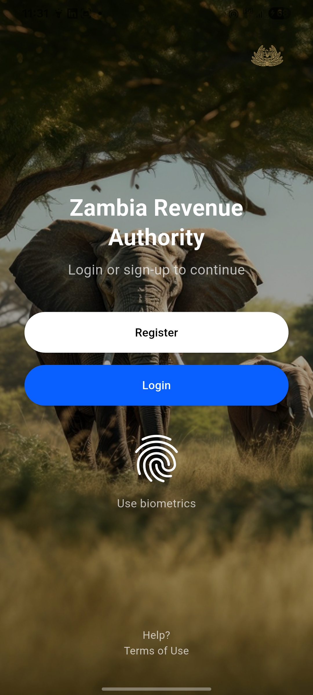
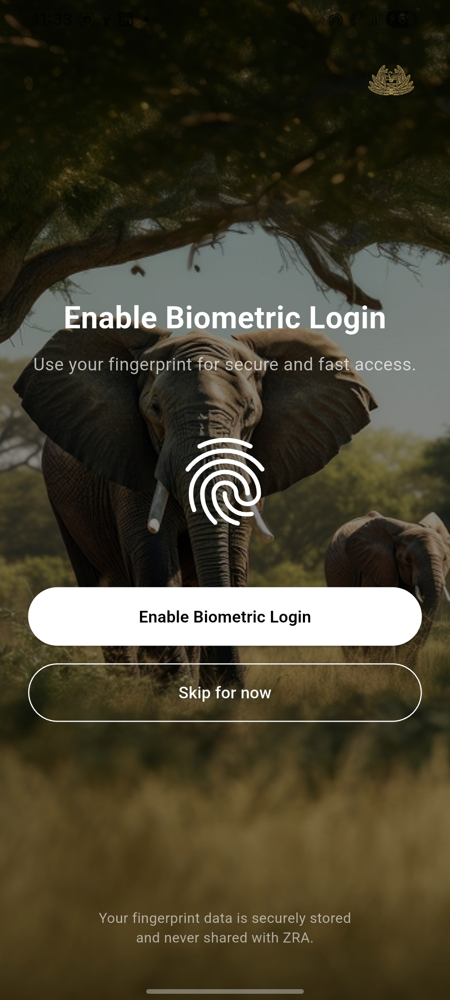
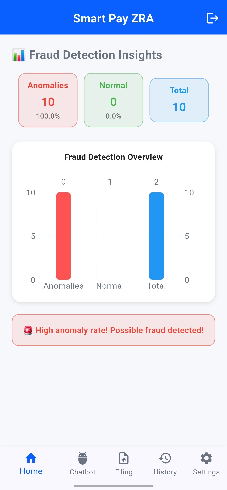
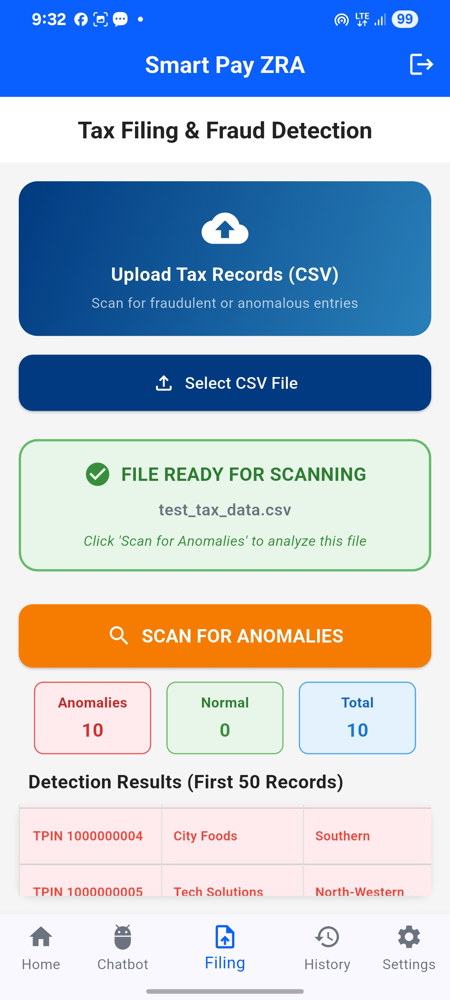

# Smart Pay ZRA

Smart Pay ZRA is a Flutter-based mobile application designed to support digital tax compliance and intelligent transaction analysis in Zambia. The application combines taxpayer-oriented services with secure authentication, biometric verification, and API-based anomaly detection.

The project explores how mobile technologies, Firebase authentication, and intelligent transaction analysis can be integrated into a unified platform for improving accessibility, security, and efficiency in tax-related digital services.

## Application Preview

### Landing Page

<p align="center">
  
</p>

The landing page provides users with access to account registration and login functionality.

### User Registration

<p align="center">
  
</p>

Users can create an account using their personal information, including their phone number and taxpayer identification details.

### Phone Verification

<p align="center">
  
</p>

Smart Pay ZRA integrates Firebase Phone Authentication to verify users through a one-time password (OTP).

### Biometric Authentication

<p align="center">
  
</p>

The application uses device biometric capabilities through Flutter's `local_auth` package to provide fingerprint-based identity verification on supported devices.

### Fraud and Anomaly Detection

<p align="center">
  
</p>

Transaction data can be submitted to the application's API for anomaly analysis. The Flutter client supports CSV uploads and communicates with the backend through HTTP endpoints.

### Anomaly Detection Results

<p align="center">
  
</p>

Analysis results are returned to the application for presentation to the user, helping identify potentially unusual transaction patterns.

### SmartBot

<p align="center">
  
</p>

The application includes a SmartBot interface intended to provide users with an accessible conversational experience for tax-related assistance.

## Core Features

- Firebase phone number authentication
- OTP-based user verification
- Biometric/fingerprint authentication
- Taxpayer-oriented mobile interface
- CSV transaction data upload
- API integration for anomaly detection
- Single-record prediction support
- Server health monitoring
- Dashboard interface
- Fraud and anomaly result presentation
- SmartBot user interface
- Light and dark theme architecture

## Technology Stack

| Technology | Purpose |
|---|---|
| Flutter | Cross-platform application development |
| Dart | Primary programming language |
| Firebase Core | Firebase application integration |
| Firebase Authentication | Phone and OTP authentication |
| Cloud Firestore | Firebase database integration |
| Provider | Application state management |
| Local Auth | Device biometric authentication |
| HTTP | Backend API communication |
| File Picker | Selection of transaction files |
| CSV | CSV data processing |
| Flutter Secure Storage | Secure local storage support |
| Shared Preferences | Local preference storage support |
| FL Chart | Data visualisation support |
| Google Sign-In | Google authentication support |

## Application Architecture

The project follows a structured Flutter architecture separating application responsibilities into:

```text
lib/
├── controllers/
├── core/
│   ├── constants/
│   ├── theme/
│   └── utils/
├── models/
├── services/
├── views/
│   ├── auth/
│   ├── chat/
│   ├── filing/
│   ├── history/
│   ├── home/
│   ├── payments/
│   ├── profile/
│   └── settings/
├── widgets/
├── firebase_options.dart
└── main.dart
```

The application uses the Provider package for state management and separates authentication, API communication, biometric functionality, storage, models, views, and reusable widgets.

## Authentication Flow

The current authentication flow uses Firebase Phone Authentication.

```text
Landing Page
      │
      ├── Sign Up
      │      │
      │      ▼
      │   Phone Verification
      │      │
      │      ▼
      │     OTP
      │      │
      │      ▼
      │   Dashboard
      │
      └── Login
             │
             ▼
       Phone Verification
             │
             ▼
            OTP
             │
             ▼
         Dashboard
```

Firebase generates and validates the OTP credentials, while the application manages navigation between authentication screens.

## Anomaly Detection API Integration

The Flutter application contains an API service for communicating with the anomaly-detection backend.

Currently supported client operations include:

- Batch CSV upload through `/batch`
- Single-record prediction through `/predict`
- Backend health checking through `/health`
- Processing-status polling support through `/batch/status/{requestId}`

The API base URL is currently configured as a development network address and should be replaced with the appropriate deployed backend URL when moving to a production environment.

## Getting Started

### Prerequisites

Before running the project, ensure that you have:

- Flutter SDK installed
- Dart SDK compatible with `^3.5.3`
- Android Studio or Visual Studio Code
- Android emulator or physical Android device
- Firebase project configuration
- Internet connectivity for Firebase services

### Clone the Repository

```bash
git clone <repository-url>
cd smart_tax_zra
```

### Install Dependencies

```bash
flutter pub get
```

### Firebase Configuration

The application uses Firebase for authentication and related services.

Configure the application with your own Firebase project before running it in another environment. Firebase configuration and sensitive credentials should be managed appropriately and should not be exposed publicly.

### Run the Application

```bash
flutter run
```

To inspect available devices:

```bash
flutter devices
```

Then run against a selected device:

```bash
flutter run -d <device-id>
```

## Development Status

Smart Pay ZRA is currently under development.

Implemented or integrated functionality in the current application includes phone authentication, OTP verification, biometric authentication support, dashboard navigation, API communication, transaction-data upload, and anomaly-detection result presentation.

Some modules and supporting functionality remain under development and may contain prototype interfaces or incomplete controller/service implementations.

## Security Considerations

The application incorporates Firebase Authentication and device-level biometric authentication. Production deployment should additionally ensure that:

- API communication uses HTTPS.
- Backend endpoints are appropriately authenticated and authorised.
- Firebase security rules are correctly configured.
- Sensitive credentials are excluded from source control.
- User and taxpayer information is securely stored and transmitted.
- Development API addresses are replaced with secure production endpoints.

## Project Structure

The repository contains the Flutter client application for Smart Pay ZRA. Generated build directories and development-environment files are excluded from version control to keep the repository lightweight and reproducible.

## Future Development

Planned development can include further integration of tax filing workflows, payment services, persistent biometric preferences, expanded SmartBot functionality, improved anomaly analytics, secure production API deployment, and additional taxpayer services.

## Disclaimer

Smart Pay ZRA is a software development project and prototype. It should not be interpreted as an official Zambia Revenue Authority application or production service unless formally authorised and deployed by the relevant institution.

## Author

**Emmanuel Phiri**

Computer Science Project

## License

No open-source licence has currently been specified for this repository.